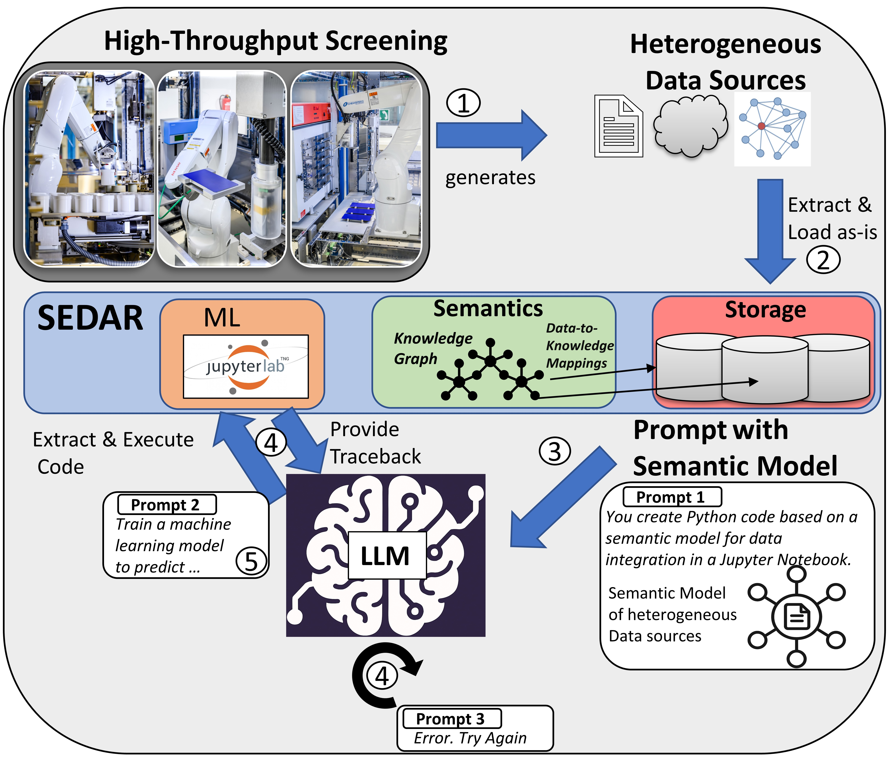

# End-To-End ML with LLMs and Semantic Data Management: Experiences from Chemistry 4.0

<p align="center">
  
</p>

This repository accompanies the paper:

**[End-To-End ML with LLMs and Semantic Data Management: Experiences from Chemistry 4.0](https://dl.acm.org/doi/10.1145/3735654.3735942)**
Sayed Hoseini, Vincent Herrmann, Christoph Quix  
Hochschule Niederrhein University of Applied Sciences, Fraunhofer FIT  
📅 DEEM ’25 — Workshop on Data Management for End-to-End Machine Learning

## 📄 Abstract

Machine Learning (ML) in industrial chemistry is often hindered by the complexity of preprocessing heterogeneous datasets. In this proof-of-concept study, we explore the use of semantic data manage- ment to support LLM-driven automation of end-to-end ML pipelines in a real-world Chemistry 4.0 setting. A semantic model is used to capture domain knowledge and metadata in a machine-readable form, guiding LLMs through natural language prompts to generate complete data wrangling and ML modeling code. We evaluate sev- eral state-of-the-art LLMs on their ability to autonomously produce functionally correct Python code for preprocessing and Gaussian Process modeling. Our results show that, when guided by struc- tured semantic context, larger LLMs can reliably generate accurate pipelines, significantly reducing the need for manual intervention. These findings provide an encouraging starting point for further exploration toward leveraging the semantic model to improve the robustness of code generation by systematically integrating rele- vant information into the generation process, rather than relying solely on the raw intelligence of the LLM.

We use a **semantic model** to provide structured metadata and guide LLMs (e.g., GPT-4, Gemini, LLaMA) via natural language prompts for code generation in data wrangling and Gaussian Process modeling. The results show that, with structured context, larger LLMs can generate functional pipelines with minimal human intervention.

## 🧪 Project Structure

```text
DEEM/
├── abrasion.csv                   # Raw abrasion test data
├── compare_dataframes.py         # Utility for comparing processed DataFrames
├── data_points.txt               # Example data points for the inital prompt
├── evaluation/                   # LLM output evaluations
├── measurements/                 # Raw measurement data
├── prompts.ipynb                 # Jupyter notebook with prompts as helper for copy-pasting into chat window
├── target.csv                    # Target ML-ready dataset
├── Testing_for_Evaluation.ipynb  # Notebook for evaluating LLM outputs
├── SM.txt                        # Semantic model (data source definition)
└── viskos_means.csv              # Raw Viscosity measurements
```

If you use this work, please cite the following paper:

```bibtex
@inproceedings{10.1145/3735654.3735942,
author = {Hoseini, Sayed and Herrmann, Vincent and Quix, Christoph},
title = {End-To-End ML with LLMs and Semantic Data Management: Experiences from Chemistry 4.0},
year = {2025},
isbn = {9798400719240},
publisher = {Association for Computing Machinery},
address = {New York, NY, USA},
url = {https://doi.org/10.1145/3735654.3735942},
doi = {10.1145/3735654.3735942},
articleno = {6},
numpages = {10},
keywords = {AutoML, Data Wrangling, LLMs, Semantic Data Management},
location = {Berlin, Germany},
series = {DEEM '25}
}

